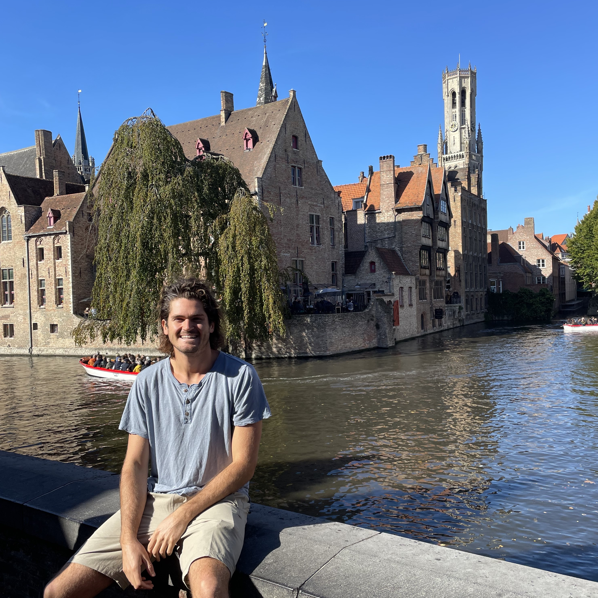
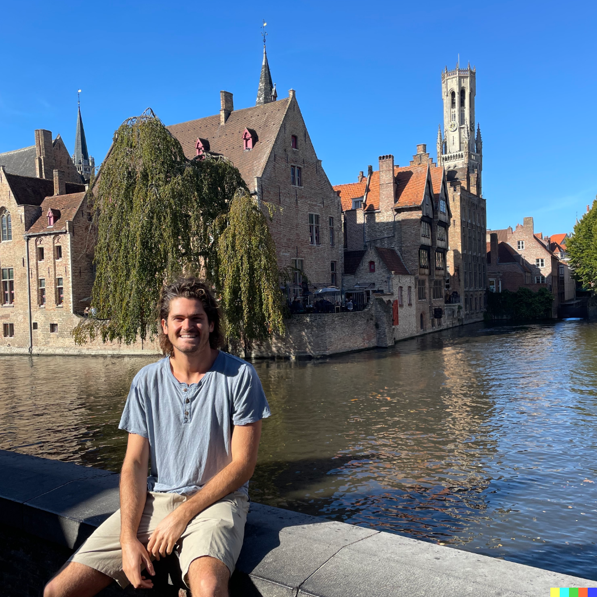
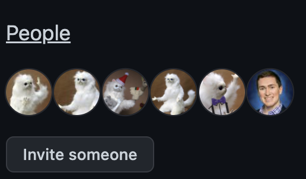
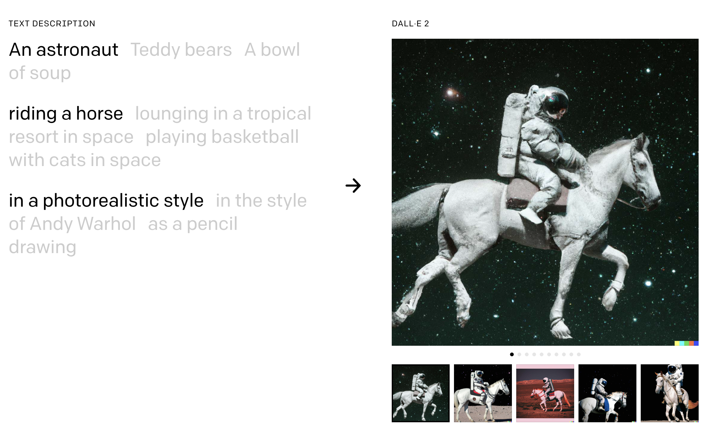
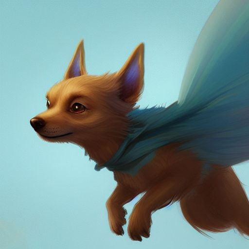
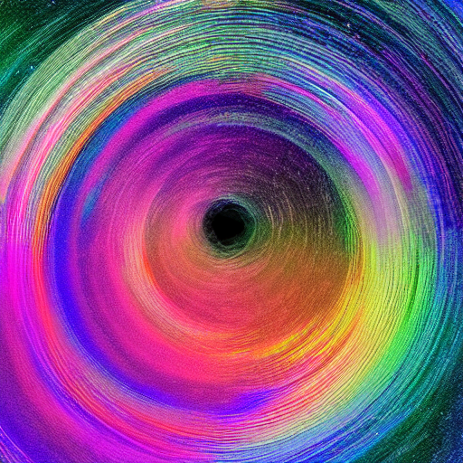
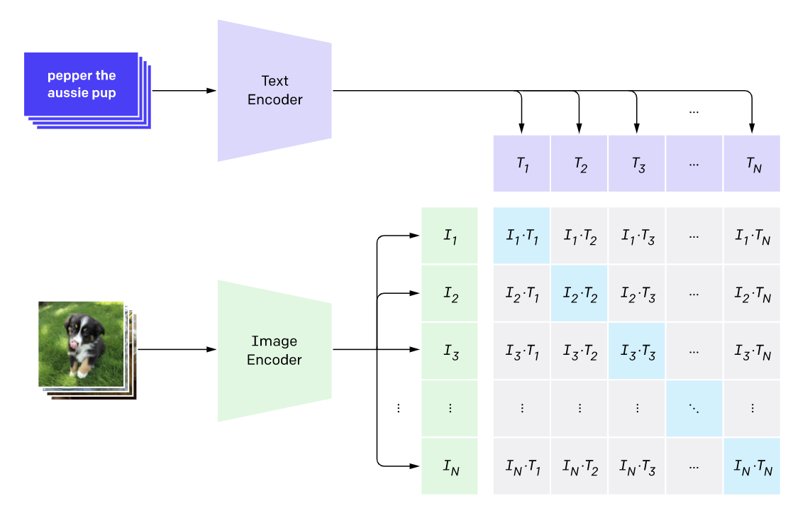
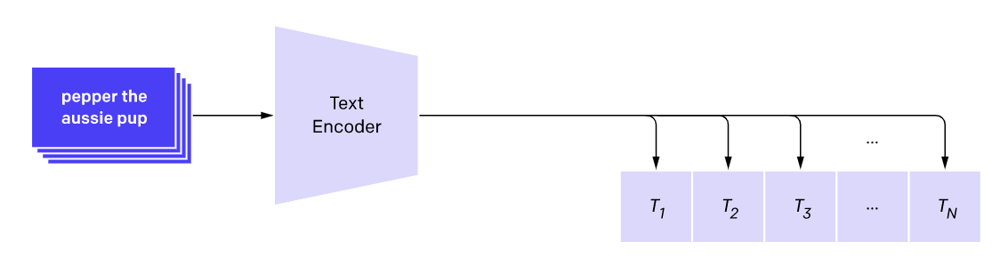
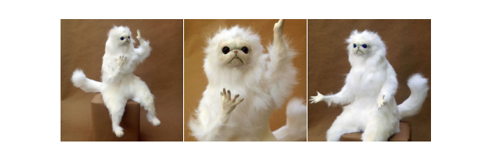
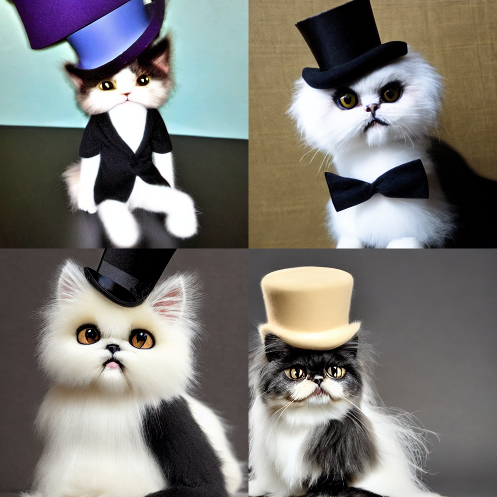

<!-- _backgroundColor: "#333" -->
<style scoped>h2{color: #EEE}</style>
## <!--fit--> Have You Ever Seen an Astronaut Riding a Horse?


<style scoped>p { color: #EEE }</style>
Image generation, theory and application


[Luke Wood]((https://lukewood.xyz))

<!-- For the technical parts, I will assume you have some knowledge of general machine learning, but not generative modeling. -->

---



---



---

### The Code, Slides, Demos

- Slides: https://lukewood.github.io/Devoxx
- Code: [https://github.com/LukeWood/Devoxx](https://github.com/LukeWood/Devoxx)

---

### About me


- From San Diego
- Work on the [Keras team](https://keras.io)
- Last year~ on [KerasCV](github.com/keras-team/keras-cv)
- Pursuing Doctorate at UC San Diego

---

### Background in Generative Modeling



- ML since 2015
- Generative modeling since 2016
- Keras team member
- Pursuing my Ph.D in ML at UC San Diego (part time)

---

### Generative modeling, why should you care...

### Historically you could....

<!-- But you could still do some fun stuff with generative modeling. -->

---

### Generate fake shoe pictures


---

### Learn the latent space of a dataset!


(More on this later...)

---

### Generate DeepFakes


---

### All quite interesting...

- but nothing particularly useful
- too difficult to control

---

### Until... DALL-E 2!

---



---

### And then... StableDiffusion!

Stable Diffusion is a deep learning, text-to-image model released by startup StabilityAI in 2022.

*Most importantly, StableDiffusion is 100% open source... and generously licensed*

---


---


_"A gentleman otter in a 19th century portrait"_

---



_"A cute magical flying dog, fantasy art drawn by Disney concept artists"_

---


_"pencil sketch of robots playing poker"_


---



_"Multicolor hyperspace"_

---

### But that's not all!

Image to image workflows GUIDED by text

---


---

Image to image inpainting (as seen in the intro)!

... and outpainting!

... and variation generation!

---


---


---


---

### Now that I have your attention...

Lets take a step back!  How does this all work?

---

### <!-- fit ---> Representations & Continuity

- AutoEncoders: travel back to 1987
- early days of ML
- no large scale data
- unfortunately, no good visual results for you!
- backprop "without a teacher"

---

### Flash forward to the 2010s
TensorFlow, GPUs, large datasets

---

### <!-- fit --> AutoEncoders are a form of compression


---

### Caveats

- data specific
- lossy
- "They are rarely used in practical applications" - Keras blog in 2016

<!-- This is why they are not used everywhere -->

---

###  <!-- fit -->  ... but what happens in between real samples?


---


__From keras.io:__
```
def plot_label_clusters(vae, data, labels):
    # display a 2D plot of the digit classes in the latent space
    z_mean, _, _ = vae.encoder.predict(data)
    plt.figure(figsize=(12, 10))
    plt.scatter(z_mean[:, 0], z_mean[:, 1], c=labels)
    plt.colorbar()
    plt.xlabel("z[0]")
    plt.ylabel("z[1]")
    plt.show()


(x_train, y_train), _ = keras.datasets.mnist.load_data()
x_train = np.expand_dims(x_train, -1).astype("float32") / 255

plot_label_clusters(vae, x_train, y_train)
```

---


##### Continuity!

> Latent space walking, or latent space exploration, is the process of sampling a point in latent space and incrementally changing the latent representation. Its most common application is generating animations where each sampled point is fed to the decoder and is stored as a frame in the final animation. For high-quality latent representations, this produces coherent-looking animations. These animations can provide insight into the feature map of the latent space, and can ultimately lead to improvements in the training process.

---

#


Panda :arrow_right: Plane

---


#


Dog :arrow_right: Bowl of fruit

---


---


---

##### A quick aside on Variational AutoEncoders (VAEs)...

```python
class Sampling(layers.Layer):
    """Uses (z_mean, z_log_var) to sample z, the vector encoding a digit."""

    def call(self, inputs):
        z_mean, z_log_var = inputs
        batch = tf.shape(z_mean)[0]
        dim = tf.shape(z_mean)[1]
        epsilon = tf.keras.backend.random_normal(shape=(batch, dim))
        return z_mean + tf.exp(0.5 * z_log_var) * epsilon
```

---

# Any Questions?

(on continuity only please)

---

# Congratulations!

You now understand approximately 1/4 of StableDiffusion.

---


---


<!-- Next, we will cover the diffusion model. -->

---

# Diffusion Models

[_Denoising Diffusion Probabilistic Models_, 2020](https://arxiv.org/abs/2006.11239)

---


---


---

#### Super-resolution

<style scoped>
ul {
  font-size: 0.8em;
}
</style>


- [Image Super-Resolution using an Efficient Sub-Pixel CNN](https://keras.io/examples/vision/super_resolution_sub_pixel/)
- [Enhanced Deep Residual Networks for single-image super-resolution](https://keras.io/examples/vision/edsr/)

<!-- You may be familiar with the idea of super-resolution: it's possible to train a deep learning model to denoise an input image -- and thereby turn it into a higher-resolution version. The deep learning model doesn't do this by magically recovering the information that's missing from the noisy, low-resolution input -- rather, the model uses its training data distribution to hallucinate the visual details that would be most likely given the input. --->

---

# <!-- fit --> Push super resolution to the limit!


- start from pure noise
- proposed in 2020

---

# More reading on keras.io

- [Denoising Diffusion Implicit Models](https://keras.io/examples/generative/ddim/)

---

# Any questions?

(On diffusion models)

---

# Latent diffusion models

- improves efficiency
- use VAE decoder
- UNet

---


<!-- Next we will discuss CLIP -->

---

# CLIP

... what you need to know

---




---

# <!-- fit --> We just need the text encoder



---

# CLIP

[More reading available on the OpenAI blog post](https://openai.com/blog/clip/)


---


---

# the Final Piece...

Conditioning!

---

# Conditioning

- classic deep learning
- concatenate
- 64x64x3 :arrow_right: 64x64x4

---


---


<!-- Note that the resnet block don’t directly look at the text. But the attention layers merge those text representations in the latents. And now the next ResNet can utilize that incorporated text information in its processing.
-->

---


---


---

# That's All!

You now know how StableDiffusion works!

---

# How do I use it?

---


# Text to Image Generation


_"An astronaut riding a horse"_

---


---

#### Code:

```python
from tensorflow import keras
import keras_cv

keras.mixed_precision.set_global_policy("mixed_float16")
model = keras_cv.models.StableDiffusion(jit_compile=True)

images = model.text_to_image(
    "Teddy bears conducting machine learning research",
    batch_size=4,
)
plot_images(images)
```


---

# Image inpainting

Do I even have time? for this?

---

# Variation generation


Remember CLIP?

---


---


---

# Switch it out!

It's really that easy!

---


---


---


---

# Textual Inversion

Teach new concepts to StableDiffusion!

---


---

###### Step 1: collect 3-5 images of your object



```python
urls = [
    "https://i.imgur.com/VIedH1X.jpg",
    "https://i.imgur.com/iLkM4Ar.jpg",
    "https://i.imgur.com/eBw13hE.png",
]
files = [tf.keras.utils.get_file(origin=url) for url in urls]
# Resize images
resize = keras.layers.Resizing(height=512, width=512, crop_to_aspect_ratio=True)
images = [keras.utils.load_img(img) for img in files]
images = [keras.utils.img_to_array(img) for img in images]
images = np.array([resize(img) for img in images])
visualization.plot_gallery(images, value_range=(0, 255), rows=1, cols=3)
```

---

###### Step 2: add a special token to the model vocabulary

```python
your_token = '<any-special-name>'
tokenizer.add_token(your_token)
```

---

######  Step 3: construct an image-caption dataset
```python
your_token = '<any-special-name>'
templates = [
    "a photo of a {}",
    "a rendering of a {}",
    "a cropped photo of the {}",
    "the photo of a {}",
    # ...
]
templates = [t.format(your_token) for t in templates]

# Construct a TensorFlow dataset of the images + tokens
image_dataset = tf.data.Dataset.from_tensor_slices(images)
text_dataset = tf.data.Dataset.from_tensor_slices(templates)
# ... there is a bit more boilerplate to pre-process the text
train_ds = tf.data.Dataset.zip(
  (image_dataset.shuffle(), text_dataset.shuffle())
)
```

---

#### <!-- fit ---> Step 4: Fine Tune the TextEncoder with your new dataset!

```python
stable_diffusion.diffusion_model.trainable = False
stable_diffusion.decoder.trainable = False
stable_diffusion.text_encoder.trainable = True

trainer = StableDiffusionFineTuner(stable_diffusion, name="trainer")
optimizer = keras.optimizers.SGD(learning_rate=5e-4)
trainer.compile(optimizer=optimizer, loss="mse")

# trainer trains the StableDiffusion model for you.
trainer.fit(
    train_ds,
    epochs=10,
    steps_per_epoch=200
)
```

---

#### Results



```python
images = stable_diffusion.text_to_image(
    "a photo of <any-special-name> wearing a top hat",
    batch_size=4,
)
plot_images(images)
```

---

#### Results


```python
images = stable_diffusion.text_to_image(
    "An app icon of <any-special-name>.",
    batch_size=4,
)
plot_images(images)
```

---

## Demo Time

Prompt requests?

Follow along on [Colab](https://colab.research.google.com/drive/1HgK0LWKMs_vw3xpymmkVffEZh-P3YUYD?usp=sharing)!

---

## Conclusions

- limitless possibilities
- the power of multi-modal models
- timelines

---

## More Workflows Coming Soon

Other workflows are coming to KerasCV soon!

---

## Other links

- [Textual Inversion with Huggingface](https://colab.sandbox.google.com/github/huggingface/notebooks/blob/main/diffusers/sd_textual_inversion_training.ipynb)
- [Image variations with lambda labs](https://huggingface.co/spaces/lambdalabs/stable-diffusion-image-variations)

---

# Thank you!

- https://github.com/LukeWood/Devoxx
- https://lukewood.github.io/Devoxx
- [Keras](https://github.com/keras-team/keras)
- [KerasCV](https://github.com/keras-team/keras-cv)

---

# References:

- https://jalammar.github.io/illustrated-stable-diffusion/
- https://openai.com/blog/dall-e-introducing-outpainting/
- https://keras.io/examples/generative/vae/
- https://keras.io/examples/generative/random_walks_with_stable_diffusion/
- https://keras.io/examples/generative/ddim/
- https://openai.com/blog/clip/
- https://huggingface.co/spaces/lambdalabs/stable-diffusion-image-variations
